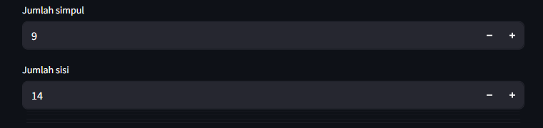
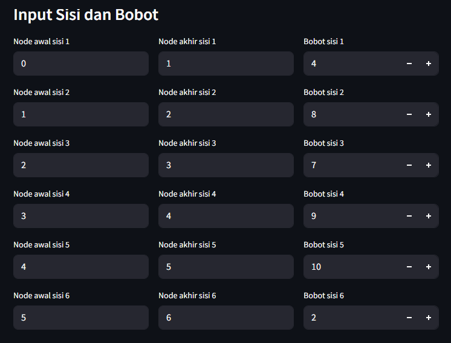
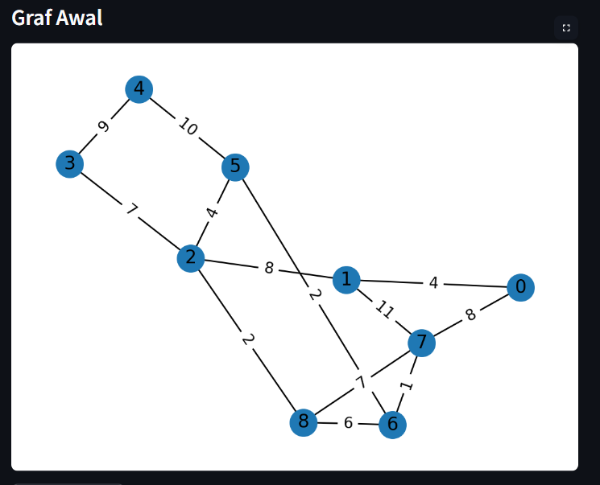
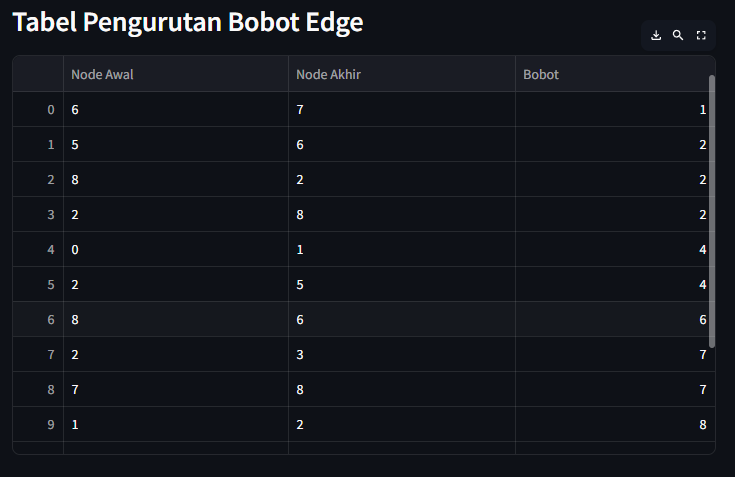
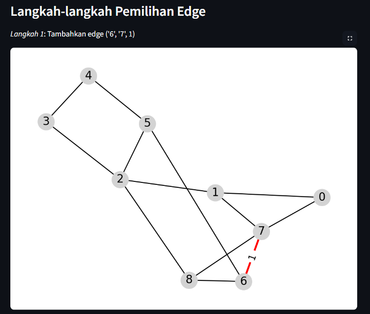

# 🎈 Visualisasi Kruskal App

Aplikasi ini memvisualisasikan cara kerja Algoritma Kruskal dalam mencari Minimum Spanning Tree (MST) dari graf berbobot.

[](https://blank-app-template.streamlit.app/)

### How to run it on your own machine

1. Install the requirements

   ```
   $ pip install -r requirements.txt
   ```

2. Run the app

   ```
   $ streamlit run streamlit_app.py
   ```

### Penggunaan Aplikasi
1. Input jumlah simpul dan jumlah sisi yang diinginkan


2. Input sisi dan bobot yang diinginkan


Hingga membentuk graf yang diperlukan yang akan muncul dan berubah setiap ada perubahan pada sisi dan bobot


3. Ketik Jalankan Kruskal


4. Terakhir akan muncul tabel pengurutan bobot,langkah pengerjaannya, dan total bobot minimum




